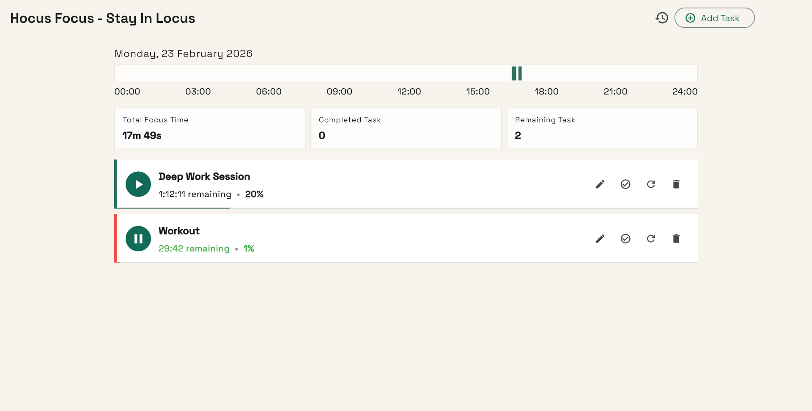
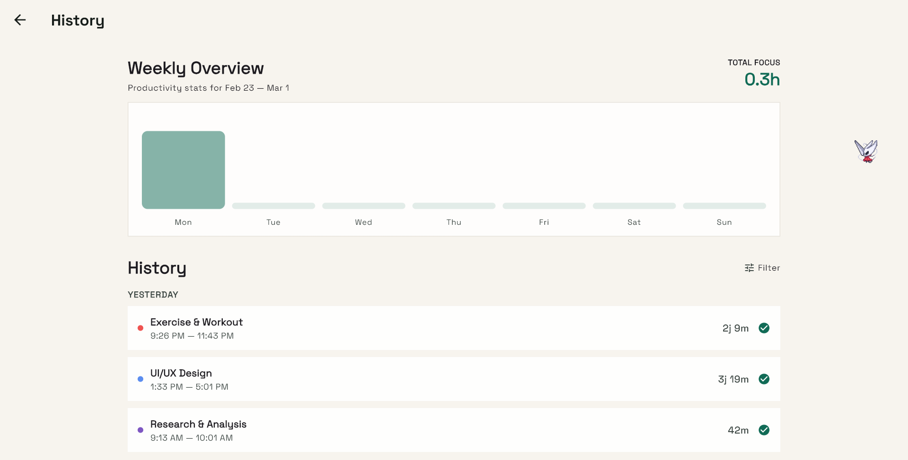
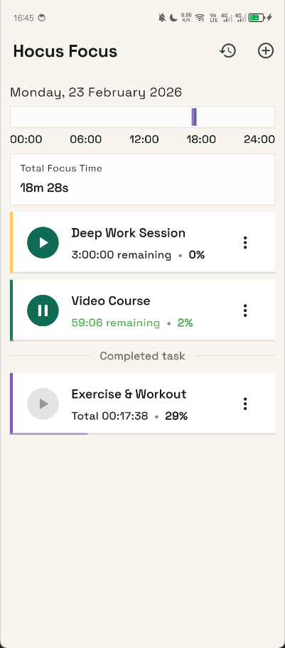
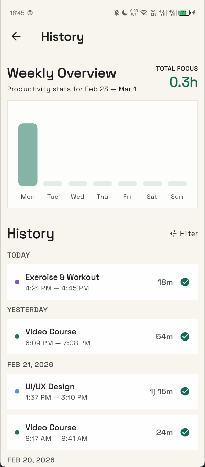

# Hocus Focus - Stay In Locus

A productivity and time tracking application built with Flutter. Track your daily tasks, monitor focus time, and analyze your productivity patterns across desktop and mobile platforms.

## App Icon


## Screenshots

### Desktop




### Mobile




## Features

- **Task Management**: Create tasks with customizable target durations, colors, and schedules
- **Time Tracking**: Start, pause, resume, and complete tasks with automatic time segment tracking
- **Flexible Scheduling**: Support for daily tasks, one-time tasks, and custom day scheduling
- **Productivity Analytics**: Weekly charts and daily statistics for focus time and task completion
- **History Tracking**: Comprehensive session history with filtering options
- **Cross-Platform**: Runs on Windows, macOS, Linux, iOS, and Android
- **Offline-First**: All data stored locally using Hive database

## Tech Stack

- **Framework**: Flutter 3.10.8+
- **State Management**: Riverpod 2.6.1
- **Local Storage**: Hive CE 2.6.0
- **Charts**: FL Chart 0.66.2
- **Typography**: Google Fonts (Space Grotesk)
- **Localization**: Indonesian (id_ID)

## Getting Started

### Prerequisites

- Flutter SDK 3.10.8 or higher
- Dart SDK (included with Flutter)
- For platform-specific builds:
  - Windows: Visual Studio 2022 with C++ development tools
  - macOS: Xcode 14+
  - Android: Android Studio with SDK 21+
  - iOS: Xcode 14+ with iOS 13+ deployment target

### Installation

1. Clone the repository

```bash
git clone https://github.com/yourusername/hocusfocus.git
cd hocusfocus
```

2. Install dependencies

```bash
flutter pub get
```

3. Run the app

```bash
# For Windows
flutter run -d windows

# For macOS
flutter run -d macos

# For Android
flutter run -d android

# For iOS
flutter run -d ios
```

## Building for Production

### Android

Generate release APK:

```bash
flutter build apk --release
```

Generate app bundle for Play Store:

```bash
flutter build appbundle --release
```

### iOS

```bash
flutter build ios --release
```

### Windows

```bash
flutter build windows --release
```

### macOS

```bash
flutter build macos --release
```

## Database Structure

Hive database is stored at: `Documents/Hocusfocus/hive/`

### Collections

- **tasks**: Task definitions (title, duration, color, schedule)
- **sessions**: Work sessions linked to tasks
- **time_segments**: Individual focus periods within sessions

## Project Structure

```
lib/
├── data/
│   ├── adapter/       # Hive type adapters
│   ├── model/         # Data models (Task, Session, TimeSegment)
│   └── repository/    # Data access layer
├── state/             # Riverpod providers and state management
├── ui/
│   ├── page/          # Main screens (Home, History, TaskForm)
│   ├── widget/        # Reusable UI components
│   └── utils/         # Utilities (formatters, generators, helpers)
└── main.dart          # App entry point
```

## License

Copyright 2026 Hocus Focus. All rights reserved.
